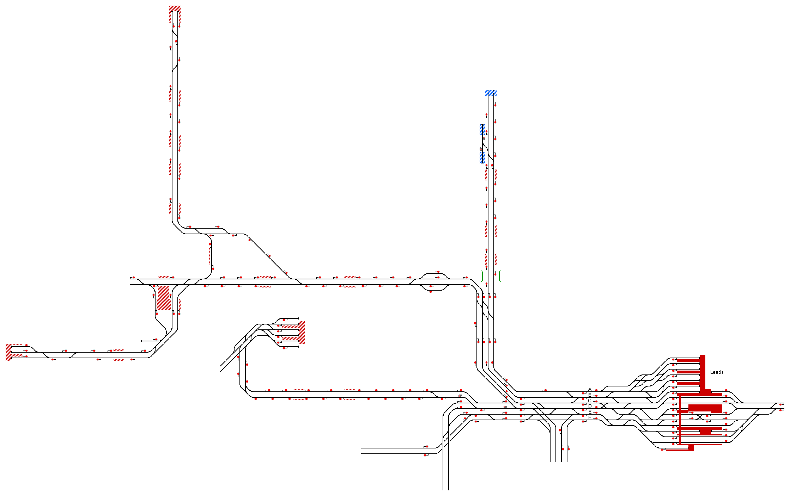

# Leeds and Bradford
A busy route covering the lines between Leeds and Bradford.

## Current Status

| Stage         | Status        |
| ------------- |:-------------:|
| Track Plan     | :heavy_check_mark: |
| Signalling      | :heavy_check_mark:      |
| Naming | :heavy_check_mark:      |
| Speed Limits | :heavy_check_mark: |
| Distances | :heavy_check_mark: |
| Timetable | :x: |
| Documentation | :x:|

## Data Sources

- [OpenStreetMap](https://www.openstreetmap.org/#map=17/53.79412/-1.54820&layers=T)
- [TRAKSY.UK](https://traksy.uk/live/M+38+LEEDS)
- [YouTube: LNER Skipton to Leeds Cab View by LNER](https://youtu.be/pItOmimx1WM)
- [Youtube: Leeds to Liverpool Lime Street Cab View by Ben Elias](https://youtu.be/mie1fhduoqc)
- [Meurisse Distance Calculator](https://map.meurisse.org/)
- [OpenRailwayMap](https://www.openrailwaymap.org/)

Status icons by Freepik, pixelmeetup, Pixel Perfect on FlatIcon.com.
